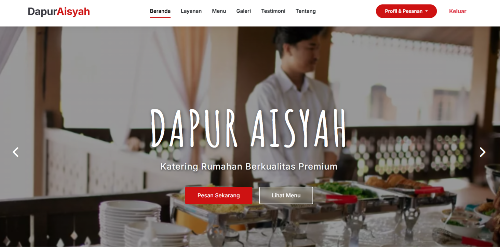
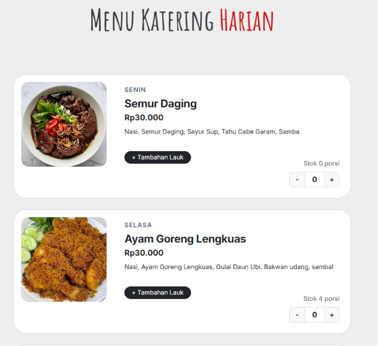
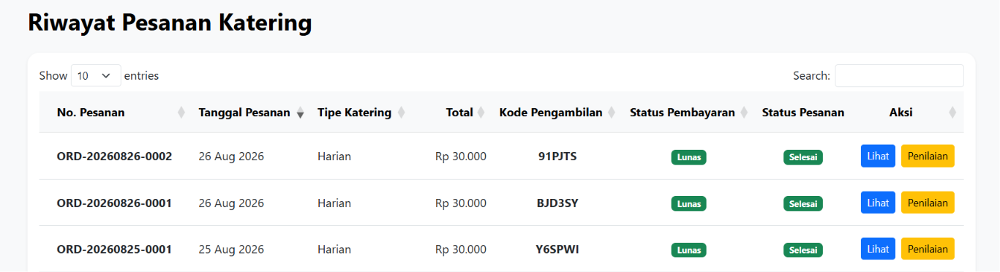
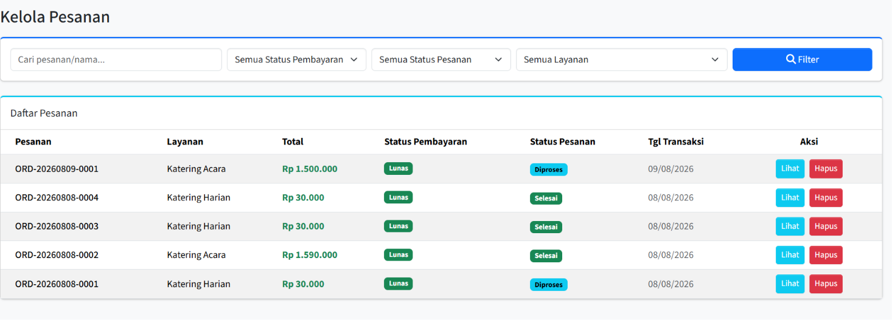
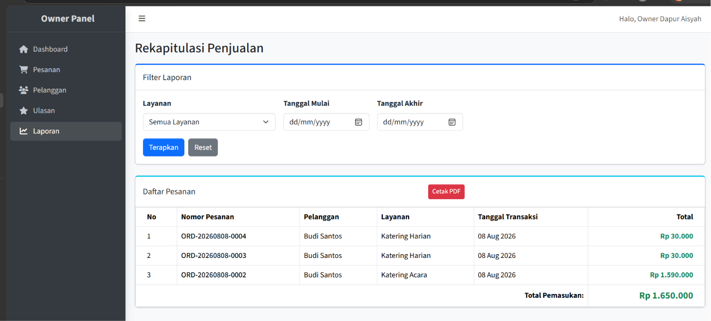

# Dapur Aisyah - Catering Management System

**Dapur Aisyah** adalah sebuah sistem informasi berbasis web dan *e-commerce* sederhana yang dirancang khusus untuk mempermudah manajemen dan pemesanan katering, mencakup layanan **Katering Harian** dan **Katering Acara**.

## 📖 Overview

Project ini dibuat untuk mendigitalisasi proses pemesanan dari sisi pelanggan dan mempermudah pengelolaan operasional di sisi pengelola. Sistem ini menyelesaikan masalah pemesanan manual, manajemen jadwal menu katering harian, manajemen stok menu katering acara, serta menyediakan proses pembayaran otomatis yang modern menggunakan **Midtrans Payment Gateway**.

---

## ✨ Features

### 🛒 Fitur Pelanggan
* 🍱 **Pemesanan Fleksibel**: Mendukung layanan Katering Harian & Katering Acara.
* 💳 **Pembayaran Online**: Terintegrasi penuh via Midtrans (Mendukung Pembayaran Penuh & Uang Muka / DP).
* 📅 **Reschedule**: Fitur penjadwalan ulang pengiriman katering sesuai kebutuhan.
* ⏱️ **Riwayat Real-time**: Melacak status dan riwayat pesanan secara *real-time*.
* ⭐ **Ulasan (Review)**: Mengelola profil pelanggan dan memberikan ulasan pelayanan katering.

### 🛠️ Fitur Admin
* 📊 **Dashboard Pesanan**: Memantau pesanan yang masuk secara *real-time*.
* 🔄 **Status Katering**: Memperbarui status pesanan (Konfirmasi, Proses, Kirim, Selesai).
* 📆 **Jadwal Harian**: Manajemen penjadwalan menu katering harian.
* 📦 **Stok Katering Acara**: Mengontrol dan manajemen stok porsi katering acara.
* 📝 **CRUD Menu Lengkap**: Mengelola data Menu Katering, Tambahan Lauk Pauk, dan Minuman.

### 👑 Fitur Owner
* 📈 **Dashboard Monitoring**: Memantau performa bisnis dan ringkasan pesanan secara menyeluruh.
* 👥 **Daftar Pelanggan**: Melihat basis data pelanggan yang terdaftar.
* 🛡️ **Moderasi Ulasan**: Melakukan moderasi (menghapus) ulasan pelanggan jika melanggar ketentuan.
* 💰 **Laporan Penjualan**: Melihat rekapitulasi laporan penjualan dan transaksi katering.
* 📄 **Cetak & Ekspor Laporan**: Fitur *generate* dan ekspor laporan keuangan menjadi format PDF.
* 🔐 **Manajemen Akun Admin**: Mengontrol akses dengan menambah, mengedit, atau menghapus akun admin.

---

## 🎭 User Roles

Sistem ini memiliki 3 Role Utama yang dibatasi keamanan aksesnya menggunakan *Middleware*:

1. 👤 **Pelanggan (Customer):** Menggunakan fitur publik untuk mengeksplor menu, melakukan pemesanan katering, dan pembayaran.
2. 👨‍💻 **Admin:** Mengoperasikan aplikasi sehari-hari, menerima pesanan, mengurus operasional, dan memperbarui katering.
3. 👑 **Owner:** Memantau analitik pesanan, mencetak laporan keuangan bulanan, dan mengelola akses karyawan (admin).

---

## 🚀 Application Flow

1. 🌐 **Guest Flow:** Pengunjung membuka website ➔ Memilih tipe layanan (Harian/Acara) ➔ Memilih lokasi pengiriman ➔ Melihat daftar menu yang tersedia.
2. 🛒 **Customer Flow:** Pelanggan Login ➔ Mengisi *form* detail pemesanan ➔ Melakukan pembayaran via Midtrans ➔ Memantau status pesanan di halaman Riwayat Pesanan.
3. 🛠️ **Admin Flow:** Admin Login ➔ Mengecek pesanan baru di Dashboard Admin ➔ Memperbarui status katering yang sedang diproses agar pelanggan tahu pesanannya sedang dikerjakan.

---

## 💻 Tech Stack

* 🐘 **Programming Language:** PHP 8.2+
* 🔴 **Framework:** Laravel 11
* 🎨 **Frontend:** Blade Templates, Tailwind CSS, Alpine.js
* 🔐 **Authentication:** Laravel Breeze
* 🗄️ **Database:** SQLite / MySQL / PostgreSQL (Tergantung konfigurasi `.env`)
* 💳 **Payment Gateway:** Midtrans (midtrans-php)
* 📄 **PDF Generator:** barryvdh/laravel-dompdf
* ⚡ **Build Tool:** Vite

---

## 📸 Screenshots

*Berikut adalah cuplikan antarmuka (UI) dari sistem Dapur Aisyah:*

### 🏠 Landing Page


### 🍔 Halaman Pemesanan & Menu


### 🕒 Riwayat Pesanan (Pelanggan)


### 📋 Manajemen Pesanan (Admin)


### 📊 Laporan Penjualan (Owner)


---

## 🗂️ Project Structure

Struktur direktori utama *(separation of concerns)* yang digunakan pada project ini:

```text
├── app/
│   ├── Http/Controllers/
│   │   ├── Admin/         # Logic untuk fitur Admin
│   │   ├── Owner/         # Logic untuk fitur Owner
│   │   └── Pelanggan/     # Logic untuk fitur Pelanggan
│   └── Models/            # Model Database (Pesanan, Menu, dll)
├── database/              # File Migrations & Seeders
├── resources/
│   └── views/             # Berisi file antarmuka (Blade) per-role
├── routes/
│   ├── web.php            # File routing aplikasi & Webhook Midtrans
│   └── auth.php           # Routing Authentikasi bawaan
└── public/                # Assets frontend & Direktori Upload
